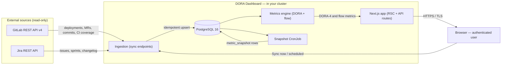
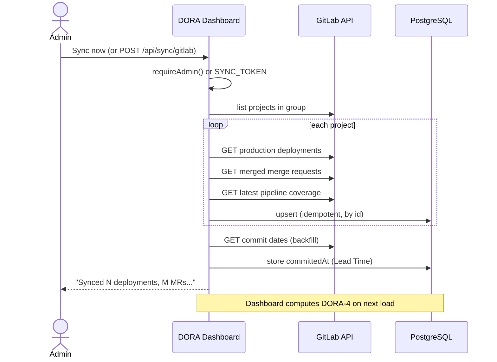
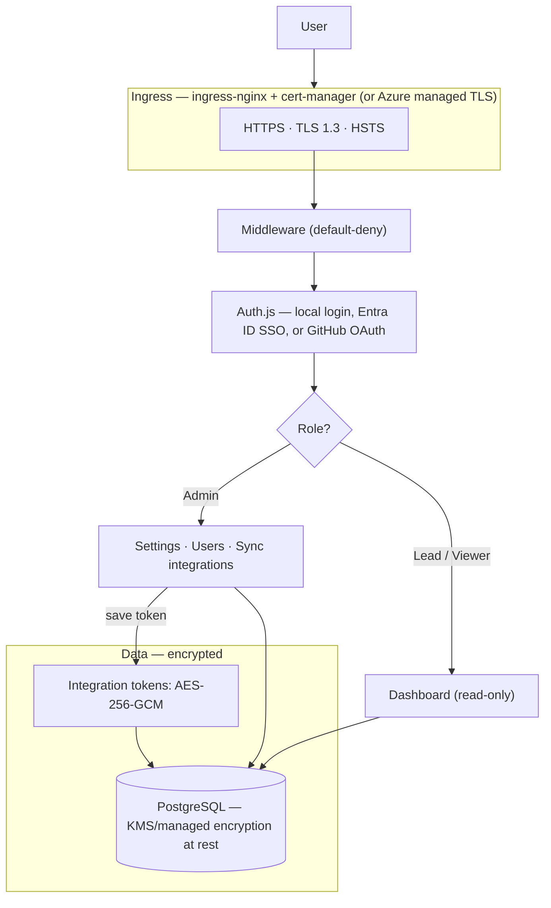

# Architecture and Data Flow

How the portal is built, how delivery data moves from **GitLab** and **Jira** into the
metrics you see, and who can access what. Everything runs inside your own cluster or
Azure subscription — no third-party data egress.

## The big picture

The portal is a single self-hosted **Next.js 16** application backed by **PostgreSQL**.
It **ingests** raw delivery events from GitLab (and Jira), **computes** DORA-4 and flow
metrics, and **serves** them to authenticated users behind SSO. The browser only ever
talks to the app over TLS; the app only ever *reads* from GitLab/Jira using a
least-privilege token; all processing and storage stay in-cluster.

## Component overview

| Layer | Technology | Responsibility |
| --- | --- | --- |
| UI / server | Next.js 16 (App Router, RSC + API routes), TypeScript 5.9 | Auth, dashboard, settings, sync endpoints |
| Design system | shadcn/ui (`radix-mira`) · Radix UI · Tailwind v4 (OKLCH tokens) · next-themes | Themed, accessible UI |
| Data layer | Drizzle ORM · postgres.js · PostgreSQL 16 | Raw events, computed data, users, audit |
| Auth | Auth.js (NextAuth v5) + Drizzle adapter | Local + Entra ID SSO + GitHub OAuth, RBAC, sessions |
| Ingestion | GitLab REST API v4, Jira REST | Deployments, MRs, commits, CI coverage, issues → Postgres |
| Metrics engine | `lib/metrics/*` (pure TypeScript) | DORA-4, flow, velocity, quality computation at read time |
| Deployment | Docker · docker-compose · Helm/K8s · Azure Container Apps / App Service | Managed TLS, secrets, private database |

### Why Drizzle instead of Prisma

Prisma relies on downloaded Rust engine binaries that are not available or compatible on
NixOS and in some restricted/air-gapped environments. **Drizzle ORM + postgres.js** are
pure TypeScript with no native or binary dependencies, so they work cleanly across the
product's target environments, with SQL-first, transparent migrations.

## Data model

Ingested and derived data live in PostgreSQL. The core tables include:

- **Auth and access** — `user`, `account`, `session`, `verification_token`,
  `sso_provider`, `audit_log`.
- **GitLab ingestion** — `gitlab_deployment`, `gitlab_incident`,
  `gitlab_merge_request`, `gitlab_coverage`.
- **Jira ingestion** — `jira_issue`, `jira_transition`, `jira_sprint`.
- **Config and derived** — `integration` (encrypted credentials), `metric_config`,
  `digest_config`, `team`, `metric_snapshot`, `sync_state`.

Timing signals used by the flow metrics (`inProgressAt`, `resolvedAt`, `blockedSeconds`)
are derived once from each Jira issue's changelog at ingest time and stored on the issue,
so metrics never require a live query back to Jira.

## How ingestion works (GitLab)

Ingestion is **idempotent and incremental** — a per-entity cursor (`sync_state`) means
repeated syncs only fetch what changed. It is triggered manually (*Sync now*) or by a
scheduler calling `POST /api/sync/gitlab`.

Jira ingestion follows the same shape via its own sync endpoint, pulling the full window
of issues with their changelog, sprints, story points, Program Increment, and parent
Feature.

## Definitions are applied at compute time

What counts as a production deployment or a change failure — the environment allowlist,
ref/branch pattern, failure statuses, rolling window, and Elite/High/Medium/Low bands —
comes from the org-level (or per-team) **metric config**, not from ingestion. Admins
change a definition under **Settings → Metrics** and it takes effect on the next
dashboard load with **no re-sync**. See the [Metrics guide](metrics.md).

## Snapshotting

Many metrics are point-in-time (Work Item Age is a snapshot of what is open now; Test
Automation Coverage is the latest value) and have no natural time series. Rather than
fabricate trends, the portal captures every metric's value on a schedule — a snapshot
CronJob, every 6 hours by default — into the `metric_snapshot` table (per team as well as
org-wide), and the trend charts draw the real stored series. A card's trend line starts
flat and fills in as history accumulates.

## Access and trust boundaries

Access is **default-deny**: every route requires an authenticated session, and privileged
actions require the **Admin** role. Integration tokens are encrypted with AES-256-GCM
before they ever touch the database.

| Role | Dashboard | Settings / Integrations | Users | Sync |
| --- | --- | --- | --- | --- |
| **Admin** | read | configure | manage | trigger |
| **Lead** | read | — | — | — |
| **Viewer** | read | — | — | — |

## Deployment shape

The same container image runs three ways:

- **Docker / docker-compose** — app + PostgreSQL + reverse proxy, for local evaluation
  and small footprints.
- **Kubernetes / Helm** — the `charts/dora-dashboard` chart (tested on AWS EKS) behind
  ingress-nginx + cert-manager, with an in-cluster or managed (RDS) database, a snapshot
  CronJob, and an optional digest CronJob.
- **Azure PaaS** — Azure Container Apps (recommended) or App Service, no Kubernetes
  required, with managed TLS, Key Vault, Managed Identity, and a private PostgreSQL
  Flexible Server.

See [Deployment](deployment.md) and [Azure](azure.md) for details. The web-security
posture (CSP, HSTS, `X-Frame-Options: DENY`, `nosniff`, Permissions-Policy) is set by the
app itself and is covered in [Security](security.md).
